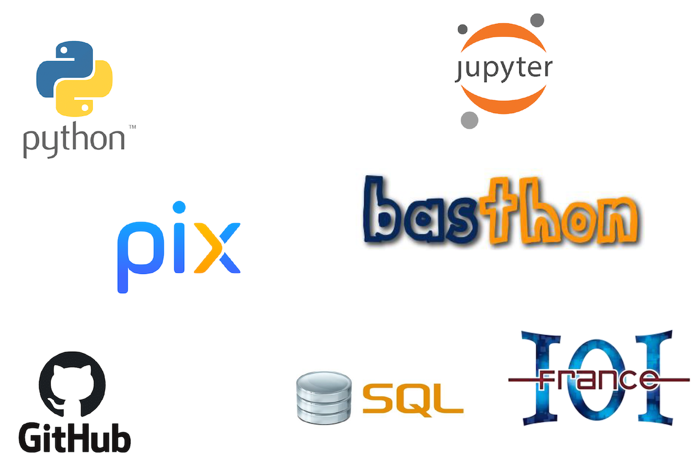

# Introduction

  ## 📖 En classe de première  

>__« Dans la nouvelle économie, l’informatique n’est plus une connaissance optionnelle. C’est une compétence basique, comme la lecture, l’écriture et l’arithmétique. »__
>
>_Barack Obama, 2016_

  ### Le programme Officiel
  >[Programme de l'enseignement de spécialité de NSI](https://cache.media.education.gouv.fr/file/SPE8_MENJ_25_7_2019/93/3/spe247_annexe_1158933.pdf)  
  >_Bulletin officiel de l'éducation nationale spécial n°8 du 25 juillet 2019_
  
  Cet enseignement s’appuie sur quatre concepts fondamentaux :
  - Les **données**, qui représentent sous une forme numérique unifiée des informations très diverses : textes, images, sons, mesures physiques, sommes d’argent, etc.
  - Les **algorithmes**, qui spécifient de façon abstraite et précise des traitements à effectuer sur les données à partir d’opérations élémentaires.
  -  Les **langages**, qui permettent de traduire les algorithmes abstraits en programmes textuels ou graphiques de façon à ce qu’ils soient exécutables par les machines.
  - Les **machines**, et leurs systèmes d’exploitation, qui permettent d’exécuter des programmes en enchaînant un grand nombre d’instructions simples, assurant la persistance des données par leur stockage, et de gérer les communications. On y inclut les objets connectés et les réseaux.  
  À ces concepts s’ajoute un élément transversal : les **interfaces** qui permettent la communication avec les humains, la collecte des données et la commande des systèmes.

  En classe de terminale, le programme de NSI est découpé en 7 chapitres
  - Les **types et valeurs de base** (booléens, binaire, ASCII)
  - Les **types construits** (tuples, tableaux, dictionnaires)
  - Le **traitement de données en tables** (indexation, recherche, tri)
  - Les **interactions entre l’homme et la machine sur le Web** (HTML, intéractions, HTTP)
  - Les **architectures matérielles et systèmes d’exploitation** (von Neumann, TCP/IP, OS, IHM)
  - Les **langages et programmation** (constructions élémentaires, spécification, mise au point, bibliothèques)
  - L'**algorithmique** (parcours, tris, KNN, dichotomie)

  Un chapitre **Histoire de l'informatique** s'ajoute à ceux-ci mais il sera traité de manière transversalle tout au long des cours de première et terminale.

  Un enseignement d’informatique ne saurait se réduire à une présentation de concepts ou de méthodes sans permettre aux élèves de se les approprier en développant des **projets applicatifs**.  
  Une part de l’horaire de l’enseignement en classe de première doit être réservée à la conception et à l’élaboration de projets conduits par des groupes de deux à quatre élèves.
  
  ### La répartition en première 
  >🕦 _4 heures de cours répartis en 2 blocs de 2 heures_    

<!--

  **📝 Les évaluations**  
  - Devoirs surveillés (QCM + exos)
  - Exercices à l'écrit
  - Devoirs maison
  - Activités en classe notées
  
  **✓ Les besoins**  
  - Une clé **USB** ou un drive pour sauvegarder vos cours et TP que vous aurez modifiés
  - Des **écouteurs** avec une prise Jack 3.5mm mâle pour pouvoir écouter des vidéos parfois intégrées au cours
  - Connaître ses accès à l'**ENT** et **Pronote**
  
  **⚠️ Les règles** 
  - Etre à l’heure : une tolérance de 5mn, au delà le cours n'est plus accessible
  - Poser son téléphone dans la PhoneBox à son arrivée en classe
  - Passer aux toilettes avant ou après le cours, pas de sortie pendant le cours
  - Respecter ses camarades et le professeur 
  - Respecter le matériel qui est notre outil de travail
  
  **🛠️ Les outils**  
    
  
  **Mais aussi...**  
  
  

-->

<!--

  
 
  
  ## 💻 Notre environnement de travail    
  

  ### Jupyter Notebook
  Tous les cours et TP de cette année seront disponibles en ligne sur __Github__ à l'adresse https://github.com/abrugiere/1nsi sous forme de __Notebooks Jupyter__.  
  Jupyter Notebook est un environnement de programmation interactif permettant de créer des document intitulés "notebooks". Il s'agit de documents se présentant sous la forme d'une succession de cellules qui peuvent contenir du code __Python__, du __texte brut__, des formules mathématiques, des graphiques ou encore du texte mis en forme grâce au langage __markdown__. Les notebooks possèdent généralement l'extension `.ipynb`.

  ### Basthon
  Pour utiliser les notebooks Jupyter il faut généralement installer le logiciel sur son ordinateur, cependant il existe un outil en ligne appelé __Basthon__ (Basthon est l'acronyme de "**b**ac **à** **s**able pour py**thon**", c'est une allusion à la lutte que peut parfois représenter l'apprentissage de la programmation) qui nous permettra d'utiliser les notebooks sans rien installer et quelque soit notre plateforme (PC, mac, Linux, tablette...) 

  L'accès au site se fait à l'adresse [https://basthon.fr](https://basthon.fr) en choisissant le mode _Notebook_ (un mode _Console_ existe aussi à la manière de l'environnement _IDLE_ également disponible au lycée)

  En cas de panne du site Basthon, **Jupyter** propose un éditeur en ligne de Notebooks à l'adresse [https://jupyter.org/try-jupyter/lab](https://jupyter.org/try-jupyter/lab) le notebook peut être ouvert en utilisant le bouton _"Upload files"_ pour charger votre fichier.

  ### Le markdown
  Comme le HTML, le markdown est un langage qui permet de mettre en forme du texte en utilisant des __balises__.

  - **Pour se familiariser avec ces outils, voici un premier TP** : [Notebooks Jupyter, Basthon, Le Markdown](https://notebook.basthon.fr/?from=https://raw.githubusercontent.com/abrugiere/1nsi/main/_ressources/0.0_markdown.ipynb)  
  _(CTRL+Clic ou Clic Droit et "Ouvrir le lien dans un nouvel onglet")_

-->

